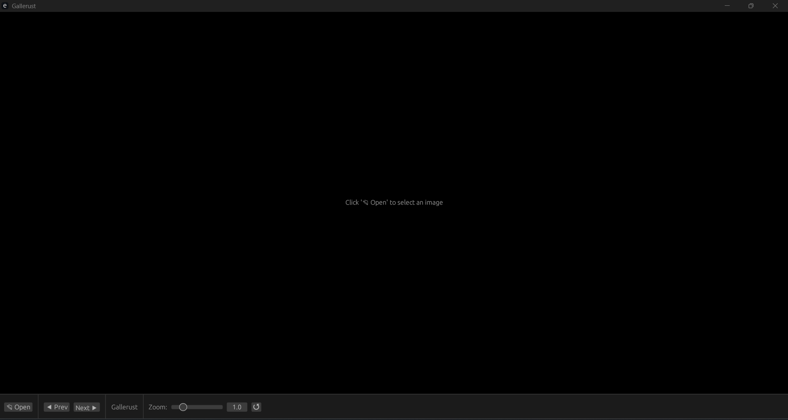

# Gallerust 🦀

A fast, minimal image viewer built in Rust using egui/eframe. Browse your photos with a clean interface and smooth zoom controls.



## Features

- 📂 Open any image and browse all photos in the same folder
- ⌨️ Navigate with arrow keys or the previous/next buttons
- 🔍 Zoom in/out with scroll wheel, pinch-to-zoom, or +/- keys
- 🖥️ Launches maximized with a clean black background
- 🪟 Windows and Linux compatible

## Supported Formats

JPG, JPEG, PNG, GIF, WEBP, BMP

## Installation

### Download a Release (easiest)
Grab the latest binary for your platform from the [Releases](../../releases) page — no Rust installation required.

### Build from Source
Requires [Rust](https://rustup.rs/) to be installed.
```bash
git clone https://github.com/drewbornt/gallerust
cd gallerust
cargo build --release
```

The compiled binary will be at `target/release/gallerust` (Linux) or `target/release/gallerust.exe` (Windows).

## Usage

| Action | Input |
|---|---|
| Open image | Click 📂 Open or launch the app |
| Next image | Arrow Right or Next button |
| Previous image | Arrow Left or Prev button |
| Zoom in | Scroll up, pinch out, or + key |
| Zoom out | Scroll down, pinch in, or - key |
| Reset zoom | Click ↺ button |

## Built With

- [eframe/egui](https://github.com/emilk/egui) — GUI framework
- [image](https://github.com/image-rs/image) — Image decoding
- [rfd](https://github.com/PolyMeilex/rfd) — Native file dialogs